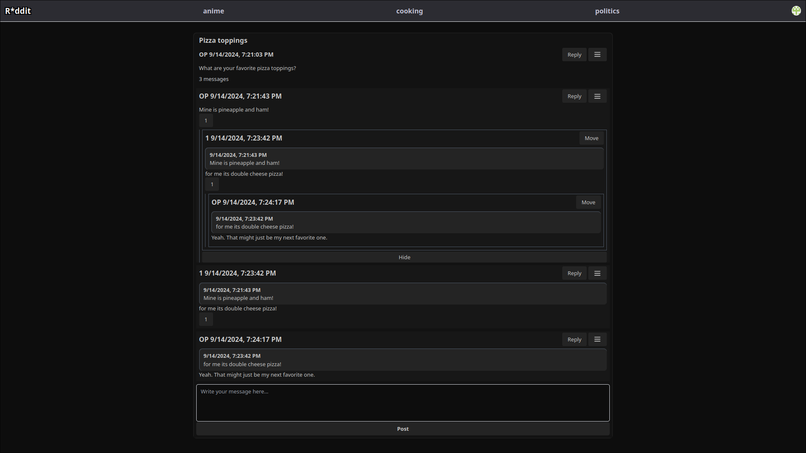

## Next.js Textboard Application

### Overview

This application is a textboard-style platform currently under active development. It leverages the following technologies:

- **Authentication**: Clerk
- **Language**: TypeScript
- **Database**: MongoDB
- **Styling**: TailwindCSS
- **Schema Validation**: Zod
- **Framework**: Next.js 14 with App Directory and Server Components

Despite its name, the application functions more like a traditional textboard.

### Features



- User authentication with Clerk
- Making posts with text. Replying to posts.
- Mobile friendly user interface that works well on both desktop and mobile devices.
- Viewing posts and comments
- Basic mod tooling like banning users and deleting posts
- Reporting posts. Reports can be moderated by the moderator.

### TODO List
- **Refine typing**: Improve type safety by eliminating the use of `any` throughout the application.
- **Write Tests**: Develop comprehensive tests to ensure the robustness and reliability of the application.

---

## Getting Started

### Prerequisites
- Node.js 18.x
- MongoDB
- Clerk

### Installation
1. Clone the repository:
```bash
git clone https://github.com/Okkurat/r-ddit.git
```
2. Navigate to the project directory:
```bash
cd r-ddit
```
3. Install dependencies:
```bash
npm install
```
4. Create a `.env` file in the root directory and add the following environment variables:
```bash
MONGODB_URI=mongodb+srv://<username>:<password>@<cluster-url>/<database-name>?retryWrites=true&w=majority
CLERK_SECRET=<clerk-secret>
CLERK_API_KEY=<clerk-api-key>
```
5. Start the application:
```bash
npm run dev
```

---

## Cron job

The application has a possible cron job that can be used to remove expired bans from the database. The route for this job is `/api/bans`.